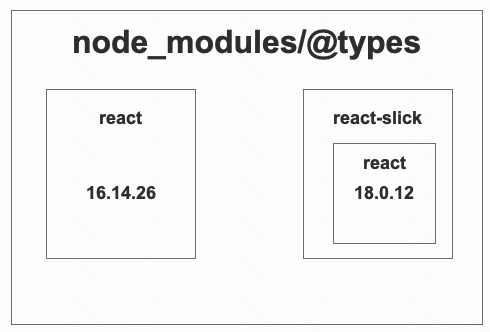
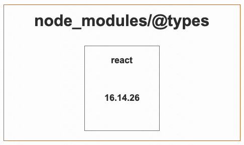
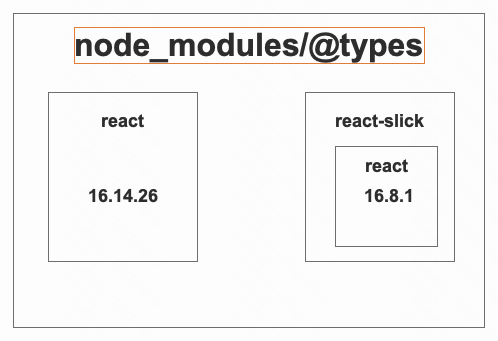
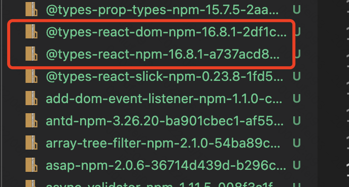
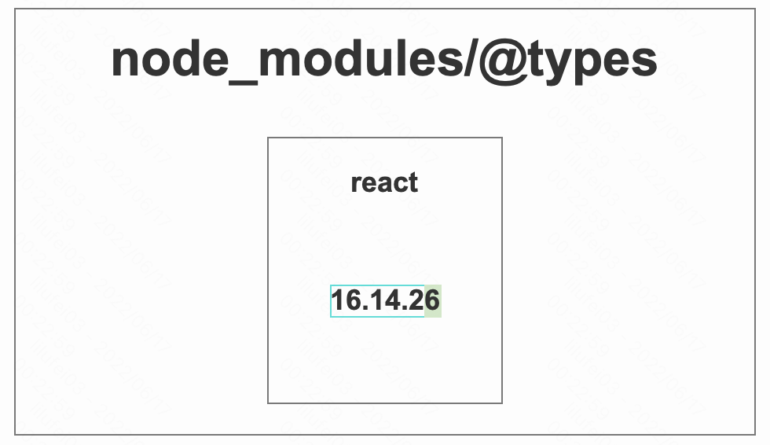

有不少用TypeScript开发项目的小伙伴遇到这个情况
<div style="background-color: lightgray; color: #000">
    本地之前运行的好好的代码，因为某些原因（pull到的代码有依赖变更、自己做了依赖变更）删除了 node_modules 和 package-lock.json，重新执行 npm install 之后项目却报出了很多 ts 异常，看到冗长的报错链，不禁一阵头大。
</div>  
<br />
出现这种问题大概率是因为依赖版本冲突导致的。按照常规思路，需要把冲突版本降级为同一范围内版本才可以。但现实很残酷

```tsx
 "dependencies": {
    "@types/react": "*"
  }
```

面对这种场景，我能做的就是掐腰吐口水～  

难道真的无解了么？当然不是，npm、yarn 等早就帮我们提供了解决方案，就是下面要重点说的 **`resolutions`** 字段。

### 定义

> resolutions 允许我们指定依赖的固定或者范围性（依赖范围内）版本，当安装依赖时，会以指定的版本为标准安装

### 为什么要提出 resolutions 字段

通过 yarn 官方的 [rfc](https://github.com/yarnpkg/rfcs/blob/master/implemented/0000-selective-versions-resolutions.md) 文档可以得知, **一般来说，包管理器无法强制嵌套的依赖（也就是node_modules/xxx/node_modules）使用指定的版本**，这就造成了如果依赖出现版本冲突，顶层只能存在一个版本，其余冲突版本都会存在于各个嵌套依赖中，也就是会造成开头说的问题。

那添加 `resolutions` 字段后会是什么表现呢？废话不多少，直接以实际项目遇到的问题举例。

### 该怎么使用 resolutions

很简单，只需以下几步

1. 在 `package.json` 中定义 `resolutions` 字段
2. 在 `resolutions` 字段中添加需要指定版本的依赖
3. 之后就重新下载依赖就可以了

### 验证 resolutions 行为

#### 1.环境准备

为了减少干扰，我们初始化一个新的项目（[仓库地址](https://github.com/yolilufei/test-resolutions-within-packageJson/blob/master/package.json)），只安装有问题的依赖。

依赖项如下：

- antd@3.26.20
- @types/react@16.8.1
- @types/react-dom@16.8.1

有冲突的依赖是`@types/react`, 我们在外部定义的版本为 `16.8.1`,其中 antd 依赖的 react-slick 依赖的 `@types/react` 版本为 `*` 即安装最新稳定版本

#### 2.包管理器

这里只是用了两种包管理器

- npm
- yarn

使用的版本如下

| 包管理器 | 版本1 | 版本2 | 版本3 |
| -- | -- | -- | -- |
| npm | v6 | v7 | v8 |
| yarn | v1 | v>=2 | -- |

#### 3.开始验证

前置定义：scope 表示依赖所在的区域，比如 `dependencies` `devDependencies` 是不同的 scope。

##### 3.1 验证冲突依赖不在同一依赖scope内（仓库分支：different-scope-deps）

`package.json` 设计如下：

```json
{
    "resolutions": {
        "@types/react": "16.8.1",
        "@types/react-dom": "16.8.1"
    },
    "dependencies": {
        "antd": "^3.26.20"
    },
    "devDependencies": {
        "@types/react": "^16.8.1",
        "@types/react-dom": "^16.8.3"
    }
}
```

**使用 npm@v6 安装依赖**

1. 安装 npm@v6，可以直接安装 node@15(携带的npm默认为v7)
2. 删除 node_modules 和 package-lock
3. 执行 `npm i -f` -- 添加 -f 保证依赖全部从远端获取，排除本地 cache 干扰
4. 安装完成后查看 node_modules

如图所示：



可以看出，**在 npm@v6.14 版本下依赖没有按照 resolutions 字段的要求安装**

**使用 npm@v7 安装依赖**

1. 安装 npm@v7，可以直接安装 node@14(携带的npm默认为v6)
2. 删除 node_modules 和 package-lock
3. 执行 `npm i -f` -- 添加 -f 保证依赖全部从远端获取，排除本地 cache 干扰
4. 安装完成后查看 node_modules

如图所示：



可以看出

- 只有顶层依赖一个版本
- 版本升级没有使用指定的 **16.8.1** 版本，而是做了次版本升级

得出结论：**在 npm@v7 下依赖按照 resolutions 字段要求解决了嵌套依赖问题，但是没有按照指定的版本安装**

**使用 npm@v8 安装依赖**

效果同 v7， 此处省略

**使用 yarn@1.22.11 安装依赖**

1. 安装 yarn@1.22.11
2. 删除 node_modules 和 yarn.lock
3. 执行 `yarn install --force` -- 添加 --force 保证依赖全部从远端获取，排除本地 cache 干扰
4. 安装完成后查看 node_modules

如图所示：



可以看出，虽然还是会形成嵌套依赖，不过依赖的版本是按照`resolutions`字段定义的依赖标准安装的，和顶层依赖也在同一个主版本范围内。可以得出结果**在 yarn@v1 版本下依赖按照 resolutions 字段的版本安装，但并没有解决嵌套依赖问题**

**使用 yarn@v3 安装依赖**

1. 安装 yarn@v3 [安装地址](https://yarnpkg.com/getting-started/install)
2. 删除 node_modules 和 yarn.lock
3. 执行 `yarn install`
4. 安装完成后查看 .yarn/cache

如图所示：



可以看出，依赖没有形成嵌套（当然这主要还是归功于yarn），依赖的版本也是按照`resolutions`字段定义的依赖标准安装的。可以得出结果**在 yarn@v3 版本下依赖按照 resolutions 字段的版本安装，且没有形成嵌套依赖**

总结：**当依赖不在同一 scope 时，npm 版本为 6 的时候无法解决版本冲突问题，npm 版本大于 6 时可以解决版本冲突问题。yarn 版本为 1 时可以解决版本冲突和嵌套，不过版本会升级为最新次版本。yarn 版本为 2 及更高版本时可以完美解决版本冲突和嵌套问题**

##### 3.2 验证冲突依赖在同一依赖scope内（仓库分支：same-scope-deps）

`package.json` 设计如下：

```json
{
    "resolutions": {
        "@types/react": "16.8.1",
        "@types/react-dom": "16.8.1"
    },
    "dependencies": {
        "antd": "^3.26.20",
        "@types/react": "^16.8.1",
        "@types/react-dom": "^16.8.3"
    },
    "devDependencies": {}
}
```

**使用 npm@v6 安装依赖**

1. 安装 npm@v6，可以直接安装 node@14(携带的npm默认为v6)
2. 删除 node_modules 和 package-lock
3. 执行 `npm i -f` -- 添加 -f 保证依赖全部从远端获取，排除本地 cache 干扰
4. 安装完成后查看 node_modules

如图所示：



可以看出，**当有冲突的依赖在同一scope时， npm@v6.14 版本下依赖按照 resolutions 字段要求解决了冲突和嵌套问题，但是没有按照指定的版本安装**

**使用 npm@v7 安装依赖**

**和 3.1 表现形式一致**

**使用 npm@v8 安装依赖**

**和 3.1 表现形式一致**

**使用 yarn@1.22.11 安装依赖**

**和 3.1 表现形式一致**

**使用 yarn@v3 安装依赖**

**和 3.1 表现形式一致**

总结：**当依赖在同一 scope 时，npm 版本大于等于 6 的时候可以解决版本冲突和嵌套，不过版本会升级为最新次版本。yarn 版本为 1 时可以解决版本冲突和嵌套，不过版本会升级为最新次版本。yarn 版本为 2 及更高版本时可以完美解决版本冲突和嵌套问题**

### 结论

|包管理器|依赖在同一scope|依赖在不同scope|
|--|--|--|
|npm@v6| 可以解决版本冲突和嵌套，无法控制固定版本 | 无法解决版本冲突问题 |
|npm@7~npm@8|可以解决版本冲突和嵌套，无法控制固定版本|可以解决版本冲突和嵌套，无法控制固定版本|
|yarn@1|可以解决版本冲突和嵌套，无法控制固定版本|可以解决版本冲突和嵌套，无法控制固定版本|
|yarn@2~yarn@3|可以解决版本冲突和嵌套，无法控制固定版本|可以解决版本冲突和嵌套，无法控制固定版本|


### 参考资料

1. [yarn:selective-versions-resolutions](https://classic.yarnpkg.com/en/docs/selective-version-resolutions/#toc-how-to-use-it)
2. [the Selective Versions Resolutions RFC](https://github.com/yarnpkg/rfcs/blob/master/implemented/0000-selective-versions-resolutions.md)
